# 基于 VirtualBox 的网络攻防基础环境搭建

## 实验目的

* 掌握 VirtualBox 虚拟机的安装与使用；
* 掌握 VirtualBox 的虚拟网络类型和按需配置；
* 掌握 VirtualBox 的虚拟硬盘多重加载；

## 实验环境

以下是本次实验需要使用的网络节点说明和主要软件举例：

* VirtualBox 虚拟机
* 攻击者主机（Attacker）：Kali Rolling 2019.2
* 网关（Gateway, GW）：Debian Buster
* 靶机（Victim）：From Sqli to shell / xp-sp3 / Kali

## 实验要求

* 虚拟硬盘配置成多重加载，效果如下图所示；

* 搭建满足如下拓扑图所示的虚拟机网络拓扑；

> 根据实验宿主机的性能条件，可以适度精简靶机数量

* 完成以下网络连通性测试；
    - [x] 靶机可以直接访问攻击者主机
    - [x] 攻击者主机无法直接访问靶机
    - [x] 网关可以直接访问攻击者主机和靶机
    - [x] 靶机的所有对外上下行流量必须经过网关
    - [x] 所有节点均可以访问互联网

## 实验过程
- 配置虚拟硬盘多重加载

- 搭建虚拟机网络拓扑

   网关所需网卡：NAT网络（为了使网关可以访问攻击者主机），Host-only网络（可以进行网卡的设置），两块内部网络（分别用于搭建两块独立的局域网）

   攻击者所需网卡：NAT网络，两块不同的Host-only网络

   victim（被攻击者）所需网卡：均为内部网络，使其分为两组，分别在不同的局域网内

|     主机名称      |                          IP地址                          |
| :---------------: | :------------------------------------------------------: |
|   Kali-Attacker   |                         10.0.2.5                         |
| Debian10-Gateway  | 10.0.2.15 & 192.168.56.113 & 172.16.111.1 & 172.16.222.1 |
|   Kali-victim-1   |                      172.16.111.109                      |
|    xp-victim-1    |                      172.16.111.112                      |
|    xp-victim-2    |                      172.16.222.119                      |
| Debian10-Victim-2 |                      172.16.222.145                      |

- 靶机直接访问攻击者主机
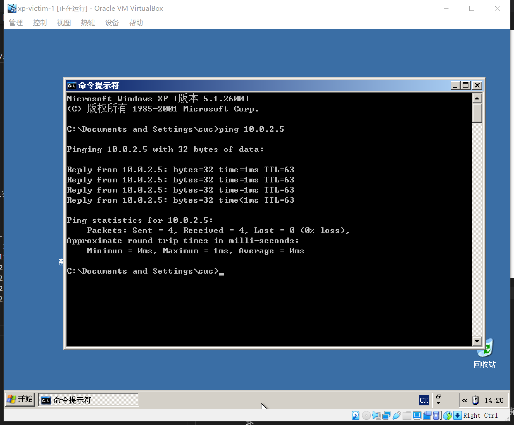
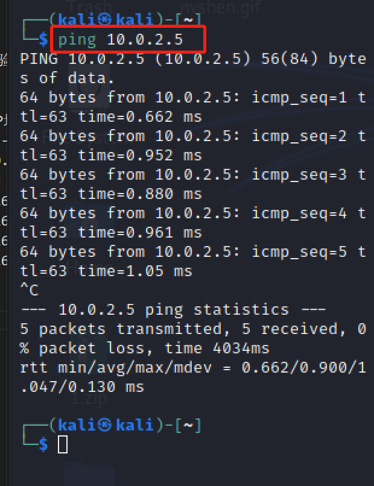
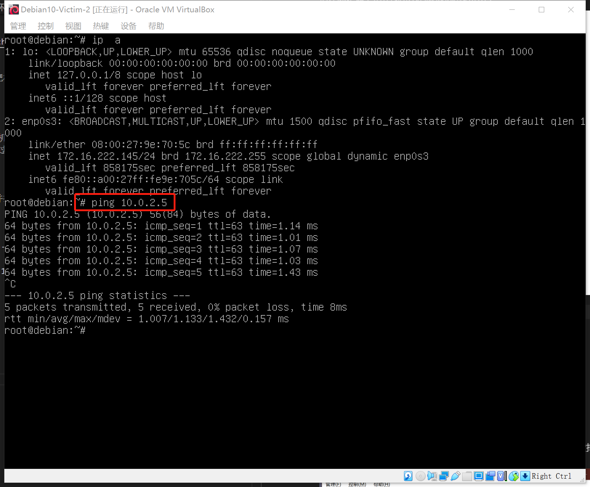
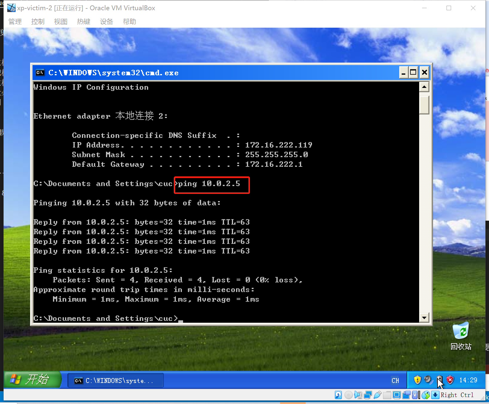

- 攻击者主机无法直接访问靶机
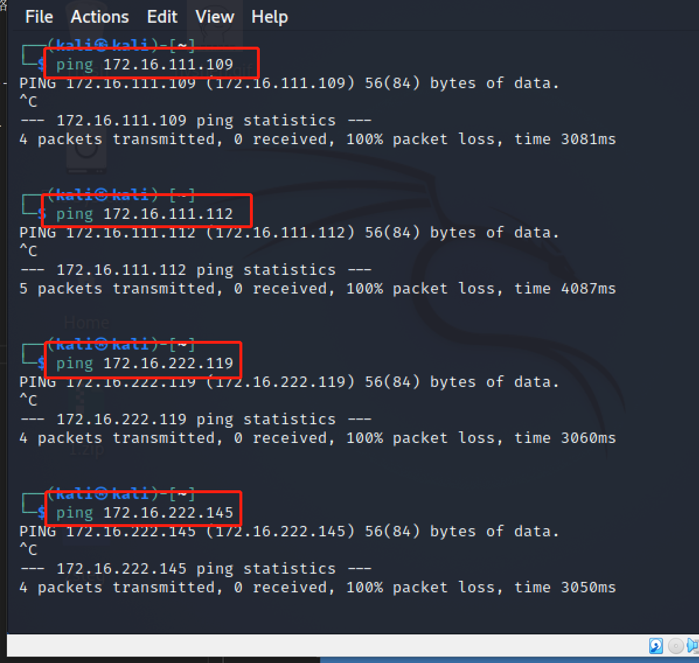

- 网关可以直接访问攻击者主机和靶机
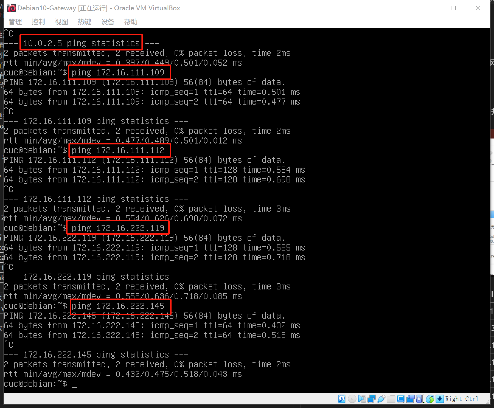

- 靶机的所有对外上下行流量必须经过网关
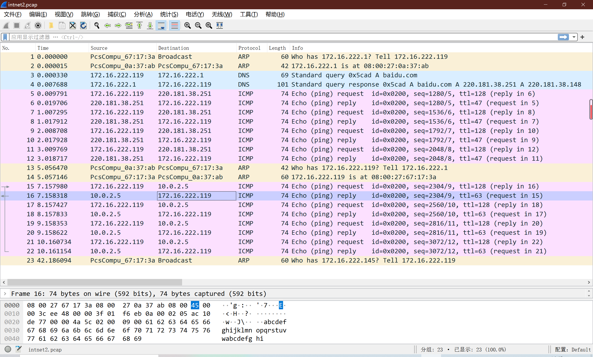

- 所有节点均可以访问互联网
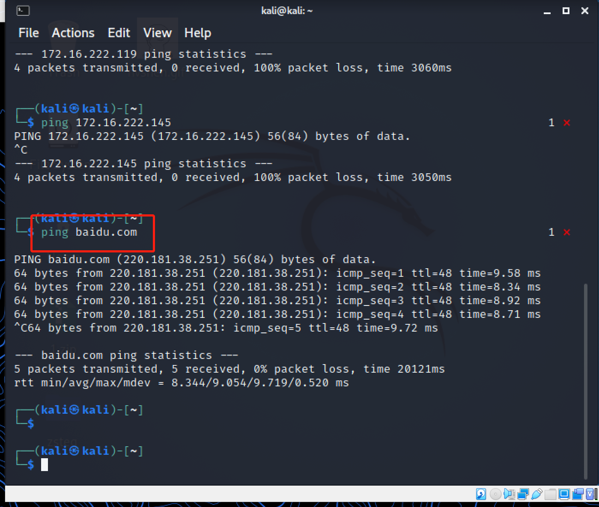
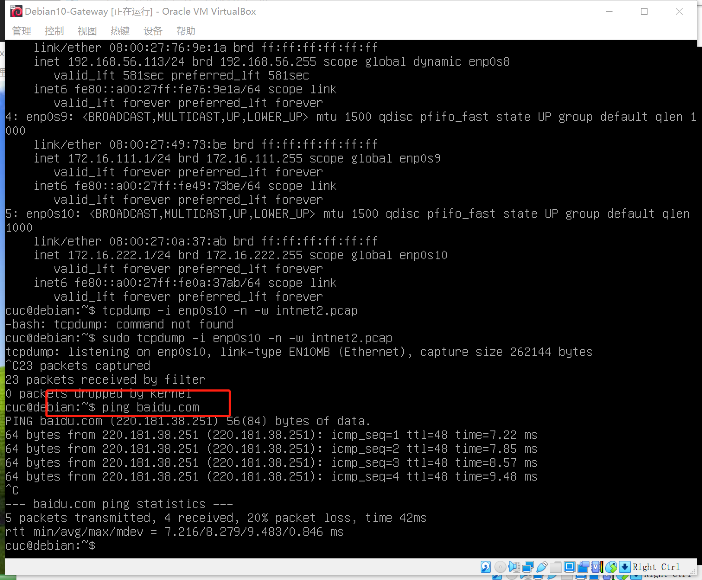
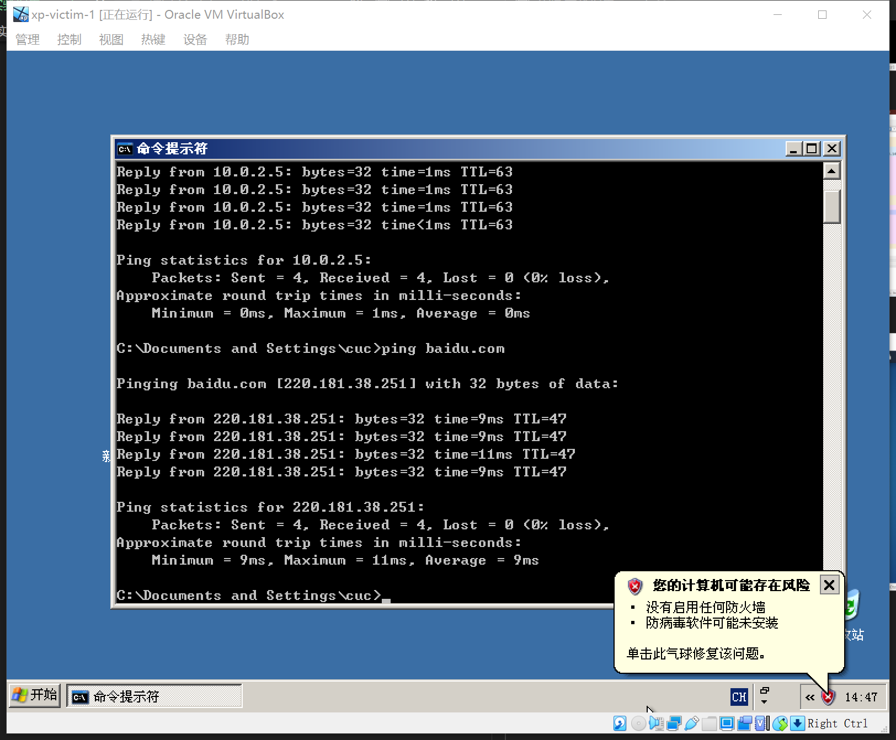
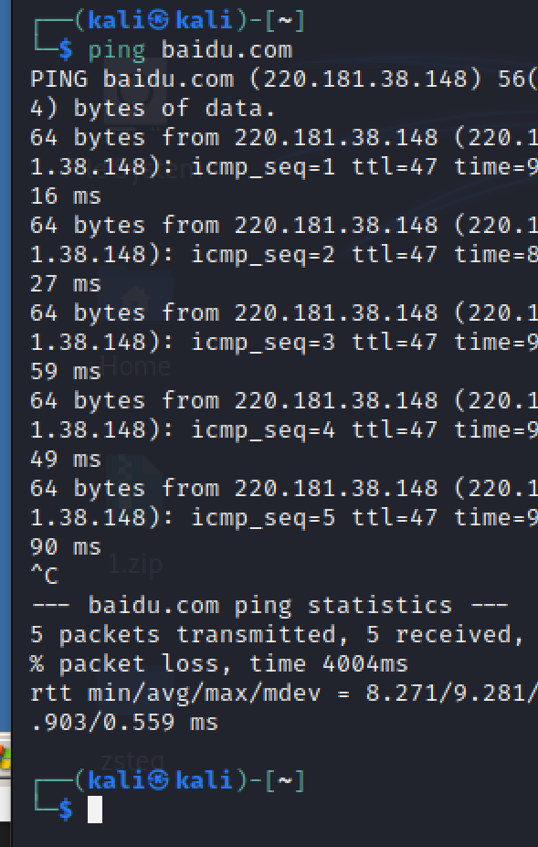
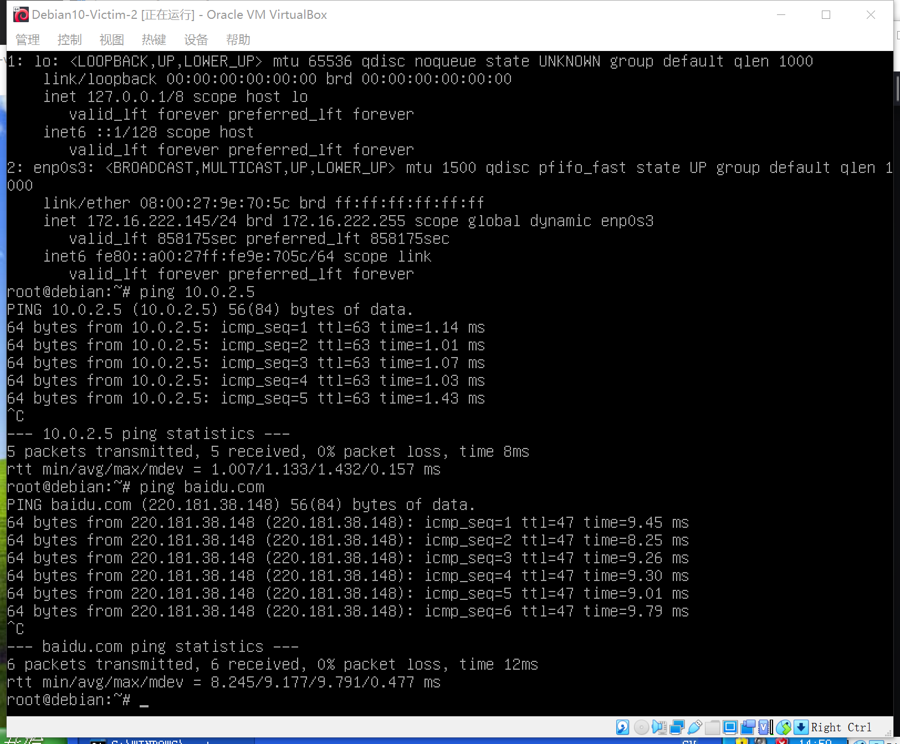
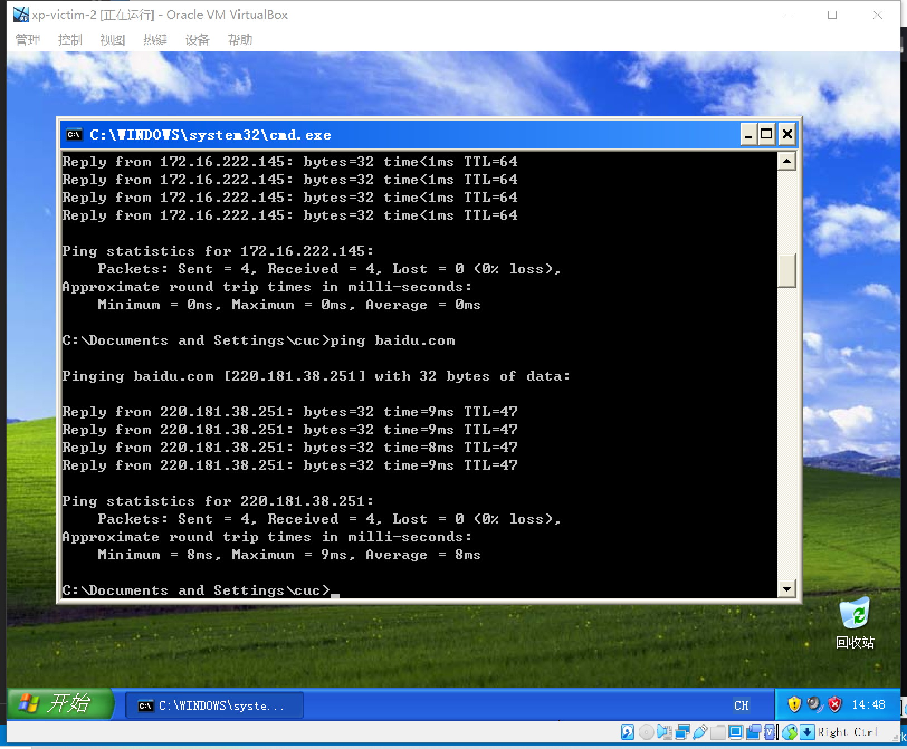

## 参考资料
- [第一次上课前准备](https://c4pr1c3.github.io/cuc-wiki/ns/2021/calendar.html)
- [基于virtualbox的网络攻防基础环境搭建](https://blog.csdn.net/lemonalla/article/details/105592150)
